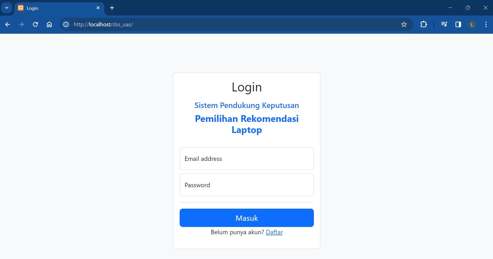
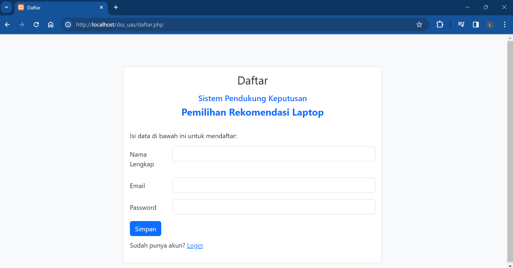
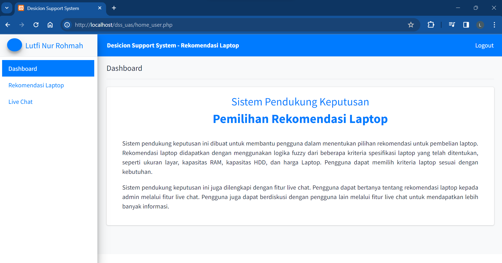
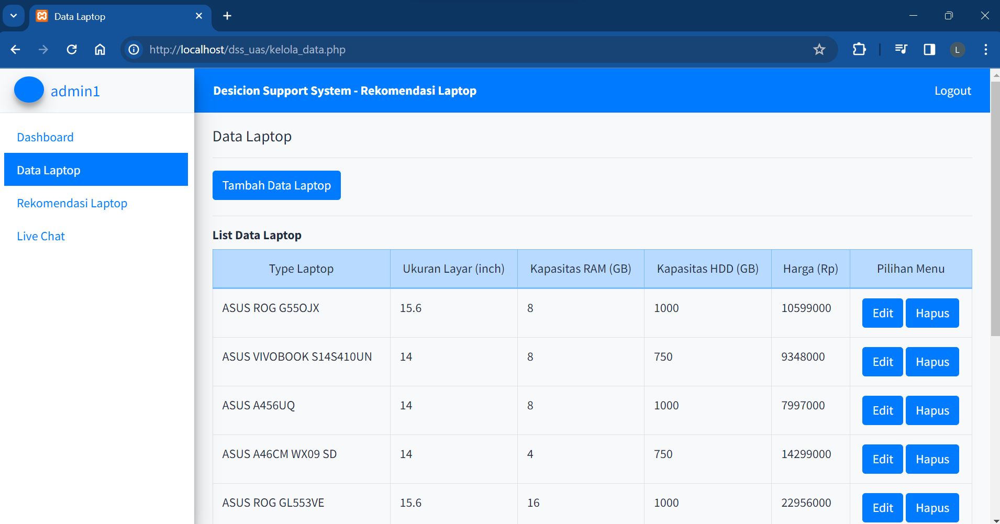
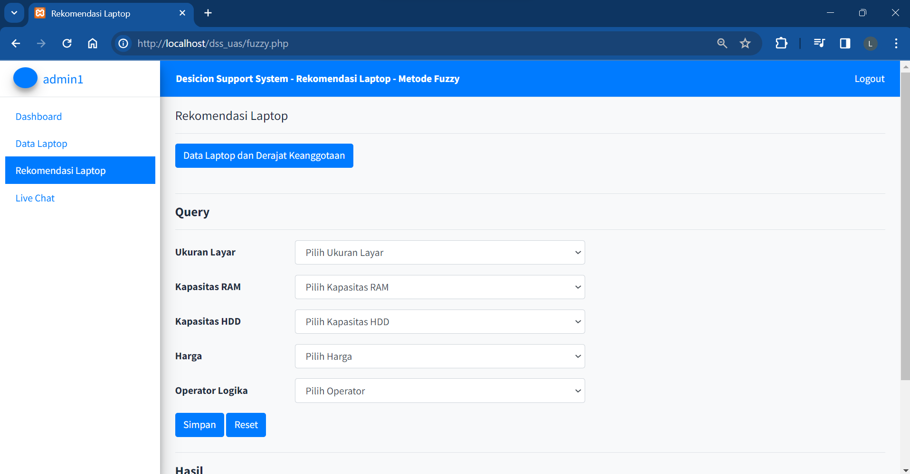
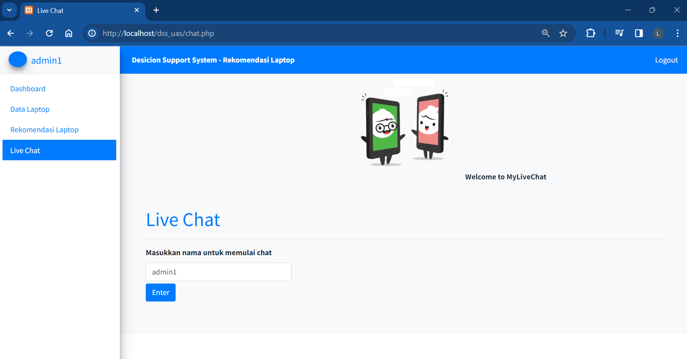
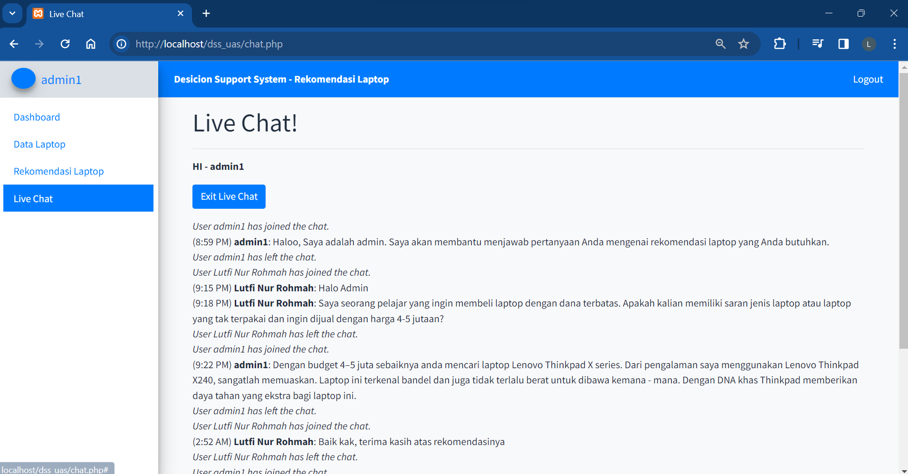

# Sistem Pendukung Keputusan "Pemilihan Rekomendasi Laptop"   

## Deskripsi
Sistem pendukung keputusan ini dibuat untuk membantu pengguna dalam menentukan pilihan rekomendasi untuk pembelian laptop. Rekomendasi laptop didapatkan dengan menggunakan logika fuzzy dari beberapa kriteria spesifikasi laptop yang telah ditentukan, seperti ukuran layar, kapasitas RAM, kapasitas HDD, dan harga Laptop. Pengguna dapat memilih kriteria laptop sesuai dengan kebutuhan.

Sistem pendukung keputusan ini juga dilengkapi dengan fitur live chat. Pengguna dapat bertanya tentang rekomendasi laptop kepada admin melalui fitur live chat. Pengguna juga dapat berdiskusi dengan pengguna lain melalui fitur live chat untuk mendapatkan lebih banyak informasi.

## Screenshoots
|   |   |
| --------------------------------------------------- | --------------------------------------------------- |
|   |   |
|  |  |
|   |   |
